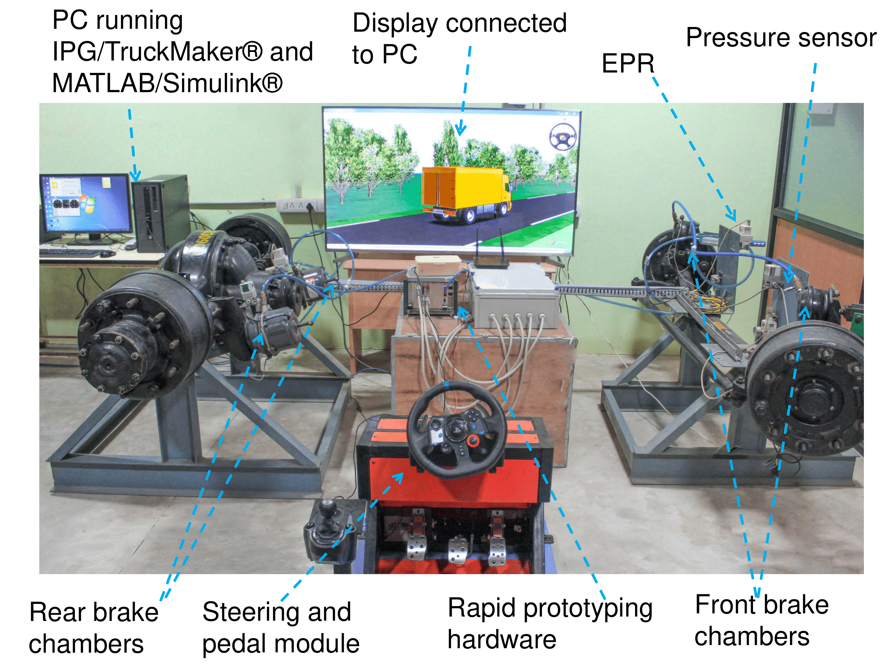

## Experimental modelling of abrasive tyre wear in heavy goods vehicles

In Heavy Goods Vehicles (HGVs), tyre selection is a key factor for the operational costs. Tyres are generally designed based on a trade-off between wear resistance and grip, indirectly affect ing rolling resistance. Low rolling resistance tyres increase the fuel efficiency, however, they have to be replaced very often. At present, it is difficult to find the optimal tyres that will minimise the fuel consumption and replacement cost because of a lack of an accurate wear prediction model. In this project, an empirical tyre wear prediction model, for two different tyres: FuelMAX (designed for low rolling resistance) and KMAX (designed for longer life), was developed through experiments. The wear model was quantified as a function of tyre vertical load and sideslip angle, subsuming other dependencies. 

Subsequently, a framework was developed in MATLAB/Simulink environment for modelling the vehicle dynamics using measured GPS routes from in-service vehicles. The framework helped in establishing the effect of lateral load transfer on tyre wear at small radius turns and roundabouts. After integrating the tyre wear model with the framework, tread-depth loss was predicted for six months of collected data from in-service vehicles. These predictions approximately agree with the field observations.

  
<iframe width="560" height="315" src="https://www.youtube.com/embed/gWutJWOZcgk" title="YouTube video player" frameborder="0" allow="accelerometer; autoplay; clipboard-write; encrypted-media; gyroscope; picture-in-picture" allowfullscreen></iframe>
  

## Developing a rule-based algorithm for anti-lock braking system (ABS) in heavy commercial road vehicles

This work provided a rule-based algorithm based on the conventional Bosch eight-phase algorithm for hydraulic braking system. The algorithm was tuned to suit the actuator dynamics of a pneumatic braking system. This rule-based algorithm was integrated with a PID brake controller along with a delay compensation technique. The control algorithm was evaluated in a Hardware-in-Loop (HiL) setup for different roads, loads and initial braking speeds. The performance of the algorithm was compared with a sliding-mode controller (SMC) based algorithm in terms of stopping distance and mean wheel slip.

|Eight phase algorithm control logic|Eight phase control loop|
|:-:|:-:|
|| |

## Simulation of wheel-lock event in a brake inertia dynamometer

This work proposed a methodical framework for emulating wheel lock in a brake dynamometer. In this study, the dynamic effects during braking, particularly load transfer, wheel slip and tyre–road interactions, are subsumed into a single variable termed ‘equivalent inertia’ to replicate a wheel lock event. The variations of this variable were captured through extensive tests on a hardware-in-the-loop platform that consists of a pneumatic brake setup interfaced with IPG TruckMaker® co-simulated with MATLAB/Simulink®, across varying load, road and braking conditions. Equivalent inertia profiles thus generated were then realized in the brake dynamometer, via mechanical discs and electrical inertia. Angular speed profiles from hardware-in-the-loop and dynamometer tests were compared to corroborate the framework. A close correlation between the profiles, highlighted by the root mean square deviation of the order of 100 rad/s, established the effectiveness of the proposed scheme.

